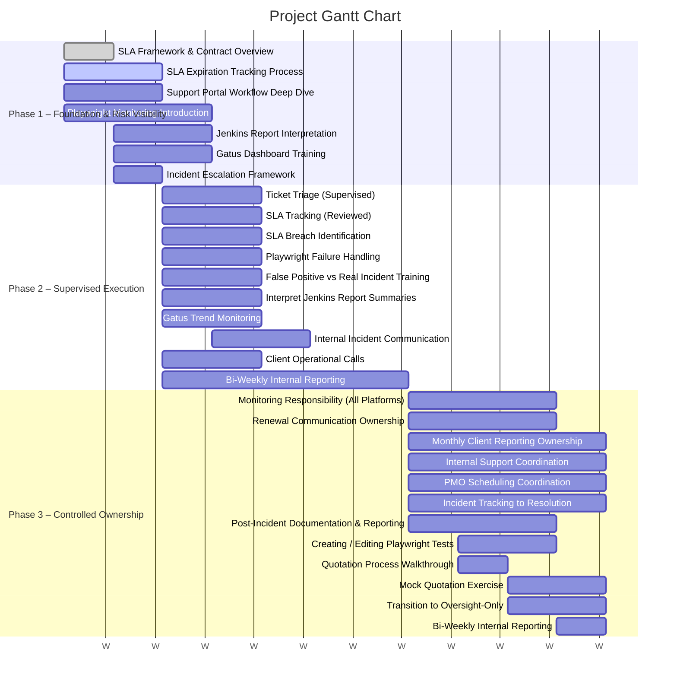

# Kartoza-support-HOTO
This repository has been created to facilitate training upskilling and the systemic takeover of the support portal. The goal is to ensure that knowlege is tranfered effectively and in bite sized bites so the neaxt team members can quickly get up and running with oversight and manage the portal to kartoza's standards.

Below is a propposed gantt chart displaying the propposed approach:

